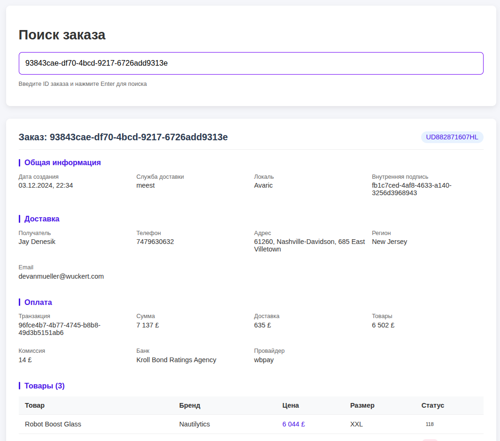
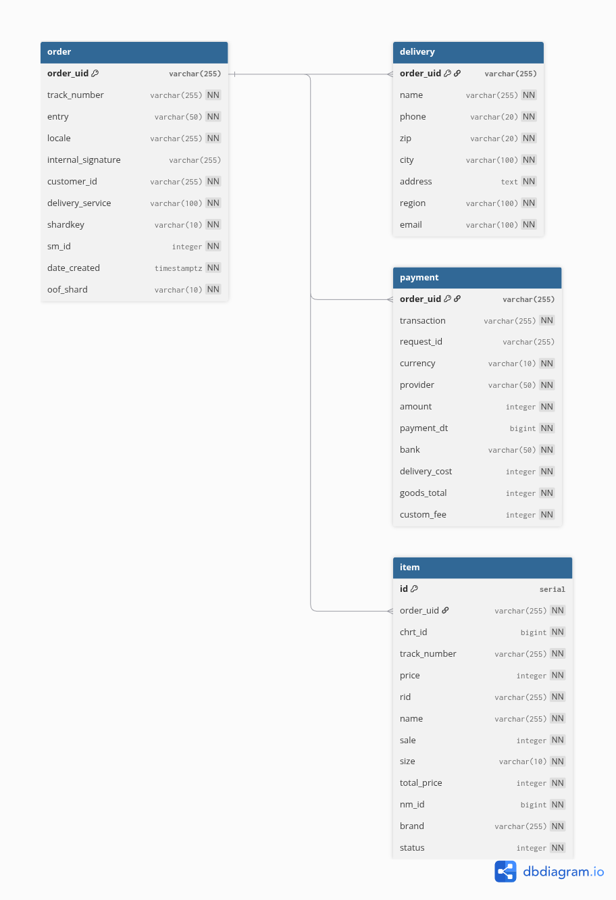

# wb-test-task
0th task for wb golang course

# Order Service

Микросервис для обработки и отображения данных о заказах с использованием Kafka, PostgreSQL и in-memory кэша.

## Главная страница




## Функционал

- Получение данных о заказах из Kafka
- Сохранение заказов в PostgreSQL
- Кэширование данных в памяти для быстрого доступа
- HTTP API для получения информации о заказе по ID
- Простой веб-интерфейс для просмотра заказов

## Технологии

- **Язык**: Go 1.23
- **База данных**: PostgreSQL 16
- **Брокер сообщений**: Bitnami/Kafka
- **Кэш**: In-memory (Map + LinkedList)
- **Веб-сервер**: gorilla/mux
- **Документация**: Swagger

## Установка и запуск

### Tребования для запуска

1. Установите Docker и Docker Compose

### Запуск инфраструктуры

```bash
docker compose up -d
```

Эта команда запустит:
- PostgreSQL на порту **5432**
- Kafka на порту **9092**
- Сам сервис на порту **8081**
- Тестовый продюсер сообщений в кафку на порту **8082** (**:8082/produce** отправит сообщение с рандомным заказом в кафку)


## Структура проекта

**1. `cmd/server/main.go`**  
- Главная точка входа приложения  
- Инициализирует конфигурацию, приложение и все зависимости  
- Запускает HTTP-сервер 

**2. `internal/app/`**  
- Ядро приложения (`app.go`)  
- Управляет жизненным циклом: запуск/остановка сервиса  
- Связывает все компоненты между собой  
- Хранит в себе репозиторий и подключение к кафке

**3. `internal/cache/`**  
- In-memory кэш на основе Map + LinkedList
- Реализует методы:  
  - Сохранение/получение заказов  
  - Восстановление из БД при старте  
- Тесты кэширования (`cache_test.go`)  

**4. `internal/config/`**  
- Загрузка конфигурации из переменных окружения для PostgreSQL

**5. `internal/repository/`**  
- Хранит в себе кэш и пул подключений к БД
- Публичные методы:
  - поиска по `order_uid`
  - добавление новых заказов
  - получение N произвольных заказов
- Использует транзакции для надежности  

**6. `pkg/models/`**  
- Модели данных (структуры с тегами JSON):  
  - `order.go`: Основная информация о заказе  
  - `delivery.go`: Данные доставки  
  - `payment.go`: Информация об оплате  
  - `item.go`: Товары в заказе  

**7. `web/`**  
- Отдается как статика через Go  

**8. `scripts/`**  
- Вспомогательные скрипты:  
  - `create_db.sql`: Настройка БД  
    - Создает все таблицы если их не было и пользователя со всеми правами
  - `kafka_producer/`: Тестовый генератор сообщений в кафку

**9. Документация (`docs/`)**  
- Swagger (OpenAPI 3.0):  
  - `swagger.yaml`: Спецификация API  
  - Доступ через `/docs/index.html`  

**10. Docker-окружение**  
- `docker-compose.yml`:  
  - PostgreSQL  
  - Kafka   
- `Dockerfile`: Сборка Go-приложения  


## Схема базы данных



## Короткое демо сервиса
https://disk.yandex.ru/i/DzIsDuUBBG1EmQ